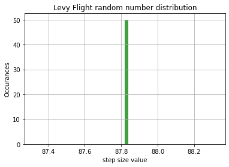

# PHSX815_Week2-repository
This repository is for the HW assigned in PHSX 815 during week 2

## HW 4
The folder HW 4 contains the files that were used in thecompletion of HW 4. These include the modified CookieAnalysis.py, CookieTimer.py, etc files.

### CookieAnalysis.py
Originally from Dr. Rogar's week 2 repository. This code was modified to ...

### CookieTimer.py
Definitely a timer. Let me look through it and make some edits when I do.

## HW 3
The files for HW 3 are contained in the file HW3. This includes Random.py and other files

### Random.py
This is the file where I implemented my own random number distribution. 

Here is the plot that was made of the distribtuion run from windows but not from terminal. 

Sorry, the image markdown isn't loading, but it's there to look at in the repository
